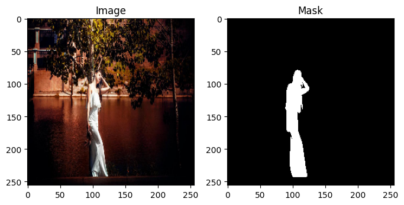
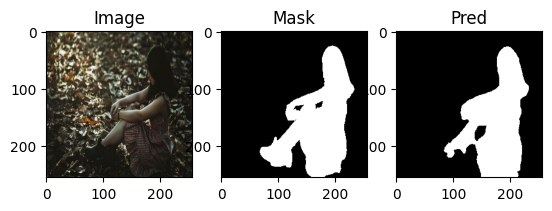
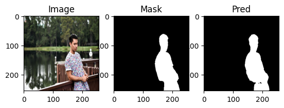
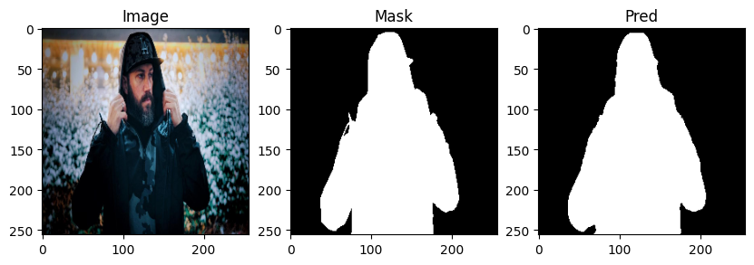
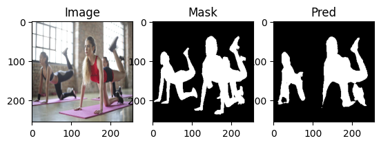
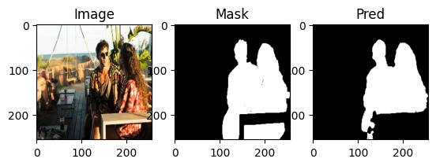
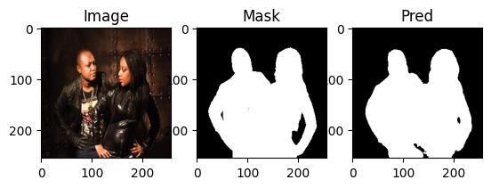

# UNet Binary Segmentation

A PyTorch implementation of UNet for binary image segmentation.

---

## 📝 Overview

This repository contains a UNet model designed for binary segmentation tasks. It processes input images and generates segmented outputs.

---
Below is an example of the segmentation result:

## Input Image

## Output Images

| Output 1 | Output 2 |
|----------|----------|
|  |  |

| Output 3 | Output 4 |
|----------|----------|
|  |  |

| Output 5 | Output 6 |
|----------|----------|
|  |  |